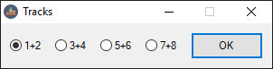
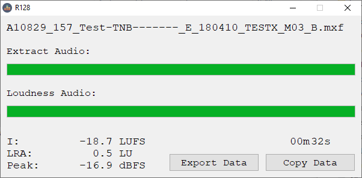

# R128
This application measures loudness according to EBU R128 with ffmpeg and ffprobe.

You can send video or audio files to the app.
Channel layout inside video can be mono or stereo. But mono files will temporarily merge to a stereo file at first.
If number of mono tracks is uneven it will return an error.

Send a file to R128.
(If opening with double click you get a file select window.)
If there are more then one stereo or two mono tracks you get a popup to choose the tracks.

The choosen tracks are first extracted to `%temp%` in 24bit and 48kHz.
Progress is shown in the gui.
Then it measures this wave file. If ready you can copy the result to the clipboard or export the data as text file to `%temp%`.

Extracted wave file will stay at `%temp%`.
So you can use the app as an audio extractor or audio converter too.

As windows FFmpeg build is licensed under GPL and therefor incompatible with MIT license I can't offer a compiled release.  
FFmpeg source can be found here: https://github.com/FFmpeg/FFmpeg  
You can download FFmpeg build under: https://www.gyan.dev/ffmpeg/builds or https://github.com/BtbN/FFmpeg-Builds/releases
